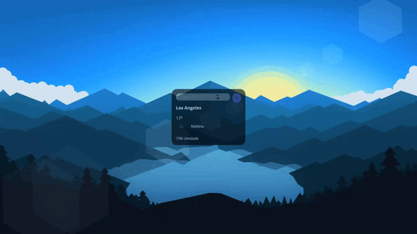

# APP Clima

### Consumindo uma API pública disponível no site: https://api.openweathermap.org 
### Mostra o clima em tempo real de qualquer cidade do mundo
### Ìcone é alterado de acordo com o clima da Cidade.
### Acréscimos foram feitos comparado ao projeto original, como limpar o input depois de digitar uma cidade e ao pressionar a tecla Enter chama a function que realiza  conexão com a API assim como clicar na lupa pesquisar

